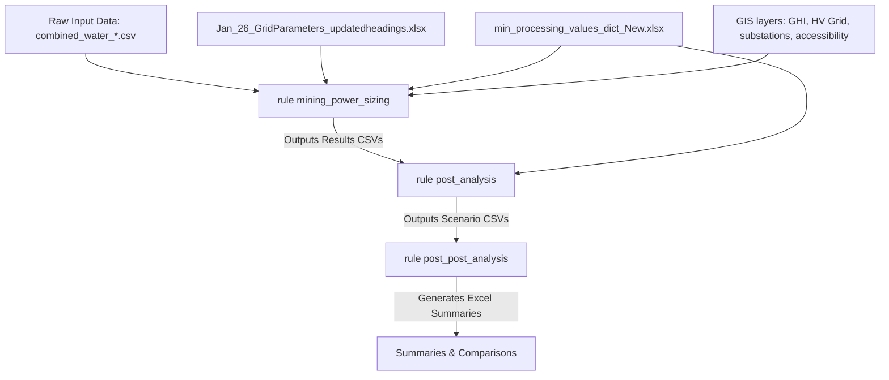

# Critical Minerals Power Sizing Workflow

This repository contains a Snakemake-based modeling pipeline designed to evaluate, size, and optimize power supply options for critical mineral mining and processing nodes across 14 East, Southern, and Central African nations. 

The workflow integrates spatial GIS analysis, hourly solar PV modeling, battery storage sizing, diesel fuel transportation costs, and utility grid constraints to decide whether a mining location should connect to the national grid or run on an off-grid solar-battery-diesel hybrid system. It also attributes capacity requirements, capital investments, and greenhouse gas emissions to specific minerals and processing stages based on their production volumes.

---

## Workflow Overview & Methodology

The pipeline processes multiple scenarios across two primary scopes (`country` and `region`) and two constraint conditions (`constrained` and `unconstrained`).



### 1. Power Solution Decision Model
For each mining site (cluster node), the model compares two main options over the project life (2023–2040):
* **Off-Grid Solution (PV-Battery-Diesel Hybrid):** The model simulates 400 different configurations (combinations of PV arrays and diesel generators) using hourly solar irradiance and temperature profiles. The configuration that minimizes the Levelized Cost of Electricity (LCOE) while satisfying a Loss of Power Supply Probability (LPSP) limit of 1% is selected. Battery sizing is dynamically matched to daily demand.
* **Grid Connection Option:** The model calculates the capital cost of extending a High-Voltage (HV) transmission line from the nearest grid line or substation to the mine. It factors in grid generation costs (LCOE), transmission line costs per kilometer, grid capacities, and line losses (5%).

**Decision Logic:** If the mine is located within 100 meters of the grid, grid connection is forced. Otherwise, if the national substation capacity utilization is under 50% and the grid extension LCOE is lower than the off-grid LCOE, the node is assigned **Grid Connection**. Otherwise, it defaults to **Off-Grid**.

### 2. Mineral & Stage Disaggregation
Mines frequently process multiple minerals (e.g., copper, cobalt, nickel) across different stages. Using country-specific energy intensity constants (kWh/tonne), the model calculates the annual electricity demand for each mineral-stage combination. Sizing metrics (required capacity in kW, final investment in USD, and CO2 emissions in $tCO_2eq$) are then allocated proportionally to each mineral and processing stage based on their share of the node's total demand.

---

## Directory & File Structure

The workspace includes the following files and scripts:

### Workflow Definition
* **[snakefile](snakefile):** Declares wildcards and defines the Snakemake execution graph with three main rules: `all`, `mining_power_sizing`, `post_analysis`, and `post_post_analysis`.

### Python Jupyter Notebooks (Workflow Steps)
* **[Mining power sizing -- Clean -- Bulk -- UpdatedJul2025.ipynb](Mining%20power%20sizing%20--%20Clean%20--%20Bulk%20--%20UpdatedJul2025.ipynb):** 
  * Extracts GIS features (mean GHI, travel time, distances to grid/substations) for each mining location.
  * Adjusts local diesel fuel costs using the Szabo formula based on travel time.
  * Simulates the PV-diesel-battery hybrid LCOE and compares it to grid extension LCOE.
  * Outputs raw results to `{OUTPUT_FOLDER}/Results/{scenario}_{scope}_{constraint}/`.
* **[Post-analysis-UpdatedJul2025.ipynb](Post-analysis-UpdatedJul2025.ipynb):**
  * Disaggregates the mine-level power investment, required capacity, and emissions to individual minerals based on demand share.
  * Outputs results to `{OUTPUT_FOLDER}/Final_Output_per_scenario/{scenario}_{scope}_{constraint}.csv`.
* **[Post Post Analysis-UpdatedJul2025.ipynb](Post%20Post%20Analysis-UpdatedJul2025.ipynb):**
  * Creates disaggregated country-level summaries (`_processed.csv` and `_mineral_summary.xlsx`).
  * Generates decision technology split comparisons (`_tech_summary.xlsx`).
  * Aggregates all scenarios into high-level Excel reports: `tech_scenario_comparison.xlsx` and `all_scenarios_comparison_combined.xlsx` under `{OUTPUT_FOLDER}/Summaries/`.

### Standalone / Archive Notebooks
* **[Demand Estimation New.ipynb](Demand%20Estimation%20New.ipynb):** Standalone notebook calculating and grouping mining electricity demand profile outputs from production tables.
* **[funcs.ipynb](funcs.ipynb):** Archive containing the original extraction, UI widgets, and helper functions (manual/GUI versions).

---

## Data Sources & Inputs

> [!IMPORTANT]
> The raw GIS datasets listed below are not included in this Git repository due to their file sizes. They must be placed manually inside the corresponding folders (under `GIS_data/`) before executing the Snakemake pipeline.

The workflow draws from two primary input directories:

### 1. Global & Country GIS Data (`GIS_data/`)
The GIS inputs are structured by country for 14 target countries: **Angola (AGO)**, **Botswana (BWA)**, **Burundi (BDI)**, **DRC (COD)**, **Kenya (KEN)**, **Madagascar (MDG)**, **Malawi (MWI)**, **Mozambique (MOZ)**, **Namibia (NAM)**, **South Africa (ZAF)**, **Tanzania (TZA)**, **Uganda (UGA)**, **Zambia (ZMB)**, and **Zimbabwe (ZWE)**.

* **Administrative Boundaries (`{country}_admin0.gpkg`):** Country shapefiles representing administrative borders.
* **Transmission Lines (`HV_lines.gpkg`):** High-voltage grid routing.
* **Substations (`substations.gpkg`):** Geographic points for grid substations.
* **GHI Solar Raster (`GHI.tif`):** Mean solar irradiance raster.
* **Accessibility Raster (`accessibility_2015.tif`):** Travel time to cities, used to adjust diesel delivery costs to remote mines.
* **Hourly Solar Curves (`{country_code_2}-2-pv.csv`):** Typical Meteorological Year (TMY) hourly datasets containing ambient temperature and solar PV capacity factors.
* **Mining Locations (`GIS_data/MiningData/Locations/combined_node_locations_for_energy_conversion_{scope}_{constraint}.gpkg`):** GPKG layers containing geospatial node points representing mining sites.
* **Water & Mine Production Targets (`GIS_data/MiningData/water/water_usage_by_location/combined_water_{scope}_{constraint}_{scenario}.csv`):** Cleaned CSVs containing production volumes (tonnes) for minerals, which trigger the Snakemake execution.

### 2. Sizing Parameters (Root Model Directory)
* **[min_processing_values_dict_New.xlsx](min_processing_values_dict_New.xlsx):** Contains country-specific electricity consumption intensities (kWh/tonne) by mineral and processing stage (e.g. mining, refining, precursor stage).
* **[Jan_26_GridParameters_updatedheadings.xlsx](Jan_26_GridParameters_updatedheadings.xlsx):** Grid statistics by country and scenario including:
  * Average Grid Generation Cost (LCOE, $/kWh)
  * Average Grid Generation Capex ($/kW)
  * Grid Emission Factor ($gCO_2eq/kWh$)

---

## Installation & Setup

### Prerequisites
* [Miniconda](https://docs.conda.io/en/latest/miniconda.html) or [Mambaforge](https://github.com/conda-forge/miniforge) installed on your system.

### Create Environment
Create the Conda environment from the provided [onsset_env.yml](onsset_env.yml) file. This ensures all spatial (GeoPandas, Rasterio, Fiona), plotting (Seaborn), and execution dependencies are correct.

```bash
# Navigate to the workspace directory
cd "path/to/Model"

# Create the environment
conda env create -f onsset_env.yml

# Activate the environment
conda activate onsset_criticalmin
```

---

## Running the Workflow

Once the Conda environment is active, you can launch the pipeline using Snakemake:

### 1. Perform a Dry Run
It is highly recommended to perform a dry run first to verify that the file paths are correctly recognized and to see which rules will execute:
```bash
snakemake -n
```

### 2. Execute the Pipeline
Run the Snakemake workflow using all available CPU cores:
```bash
snakemake --cores all
```

---

## Output Structure

The workflow automatically creates an output directory called `OutputsJan2026/` (or as defined in `OUTPUT_FOLDER` in the `snakefile`). Below is the expected directory structure, followed by a detailed description of the content and columns generated in each output file:

```
OutputsJan2026/
├── Results/
│   └── {scenario}_{scope}_{constraint}/
│       ├── {country}-{scenario}_{scope}_{constraint}.csv  # Individual country results
│       ├── {scenario}_{scope}_{constraint}.gpkg           # Merged geospatial results
│       └── {scenario}_{scope}_{constraint}.csv            # Merged tabular results
├── Final_Output_per_scenario/
│   ├── {scenario}_{scope}_{constraint}.csv                # Mineral-disaggregated results (node-level shares)
│   └── {scenario}_{scope}_{constraint}_processed.csv      # Detailed mineral-stage disaggregation outputs
└── Summaries/
    ├── {scenario}_{scope}_{constraint}_mineral_summary.xlsx  # Summary grouped by mineral and processing stage
    ├── {scenario}_{scope}_{constraint}_tech_summary.xlsx     # Technology decision split summary by country
    ├── tech_scenario_comparison.xlsx                       # Multi-scenario overall summary table
    └── all_scenarios_comparison_combined.xlsx              # Consolidated multi-scenario sheets
```

---

### Detailed File Content Descriptions

#### 1. Results Folder (`OutputsJan2026/Results/`)

* **`{country}-{scenario}_{scope}_{constraint}.csv`**
  * **Description:** Represents node-level engineering and economic power sizing outputs for a specific country under the selected scenario.
  * **Key Columns:**
    * `Consumption`: Estimated electricity consumption at the node (MWh/year).
    * `GHImean` & `TravelTmean`: Input solar index and travel accessibility (hours) from GHI and travel time rasters.
    * `HVDist_km`: Distance to the high-voltage transmission lines.
    * `HGM_lcoe` & `HMG_Inv`: Levelized Cost of Electricity ($/kWh) and Capital Investment ($) for the optimized off-grid hybrid system.
    * `HMG_ren_share`: Proportion of renewable (solar PV) contribution in the off-grid solution.
    * `Grid_Cost_USD` & `Grid_est_lcoe`: Sized cost ($) and LCOE ($/kWh) of extending grid lines to the node.
    * `Decision`: The selected power technology option (`Grid Connection` or `Off-Grid`).
    * `Final_Investment_USD`: Sized investment based on the selected decision (grid costs or off-grid CAPEX).
    * `Req_Capacity_kW` & `Est_lcoe_$perkWh`: Active capacity requirement and LCOE for the final decision.
    * `Emissions_tCO2eq`: Total carbon footprint estimated over the lifetime.

* **`{scenario}_{scope}_{constraint}.csv`**
  * **Description:** Merged tabular results containing the concatenation of all individual country CSVs for the scenario.

* **`{scenario}_{scope}_{constraint}.gpkg`**
  * **Description:** GeoPackage database containing spatial locations (points) and geometry mapping for all mines in the merged dataset.

#### 2. Disaggregated Folder (`OutputsJan2026/Final_Output_per_scenario/`)

* **`{scenario}_{scope}_{constraint}.csv`**
  * **Description:** Node-level dataset showing electricity demand attributed to each individual mineral. Sizing metrics are distributed among minerals using demand percentages.
  * **Key Columns:**
    * `{mineral}_demand_sum`: Absolute annual energy demand calculated for the mineral (kWh).
    * `{mineral}_per`: Proportional share of the mine node's total demand represented by the mineral (0.0 to 1.0).
    * `{mineral}_INV_USD`: Share of capital investment allocated to the mineral ($).
    * `{mineral}_CAP_kW`: Share of required power capacity allocated to the mineral (kW).
    * `{mineral}_EMI_tCO2eq`: Share of emissions allocated to the mineral ($tCO_2eq$).

* **`{scenario}_{scope}_{constraint}_processed.csv`**
  * **Description:** Broad-form dataset breaking down metrics by both mineral AND specific processing stages (e.g. mining vs refining vs precursor).
  * **Key Columns:**
    * `Final_Investment_USD_{mineral}_{stage}`: Disaggregated CAPEX allocation.
    * `Req_Capacity_kW_{mineral}_{stage}`: Disaggregated capacity allocation.
    * `Est_dem_kWh_year_{mineral}_{stage}`: Disaggregated annual demand allocation.
    * `Emissions_tCO2eq_{mineral}_{stage}`: Disaggregated carbon footprint allocation.
    * `annual_opex_{mineral}_{stage}`: Disaggregated yearly operating expenditure (calculated as local LCOE multiplied by disaggregated annual demand).

#### 3. Summary Reports Folder (`OutputsJan2026/Summaries/`)

* **`{scenario}_{scope}_{constraint}_mineral_summary.xlsx`**
  * **Description:** Consolidated spreadsheet containing aggregated statistics across all nodes.
  * **Sheets:**
    * `By Mineral and Stage`: Summed metrics (`Req_Capacity_kW`, `Est_dem_kWh_year`, `Emissions_tCO2eq`, `Final_Investment_USD`, `annual_opex`) grouped by mineral, processing stage, and country (ISO3).
    * `By Mineral Only`: Summed metrics grouped by mineral and country (ISO3) only (summing over all stages).

* **`{scenario}_{scope}_{constraint}_tech_summary.xlsx`**
  * **Description:** Technology and connection decision report by country.
  * **Key Columns:** Grouped by `ISO3` and `Decision` showing total investment (USD), required capacity (kW), average LCOE ($/kWh), emissions ($tCO_2eq$), operational expenditure (USD), and annual demand (kWh).

* **`tech_scenario_comparison.xlsx`**
  * **Description:** High-level scenario comparison sheet that lists every run scenario and sums its total investment, required capacity, emissions, annual opex, and annual electricity demand across the region.

* **`all_scenarios_comparison_combined.xlsx`**
  * **Description:** Multi-scenario master comparison spreadsheet.
  * **Sheets:**
    * `Overall Summary`: Aggregated regional metrics for all scenarios.
    * `Decision Split Summary`: Scenario metrics split by final power supply decision (Grid vs Off-grid).
